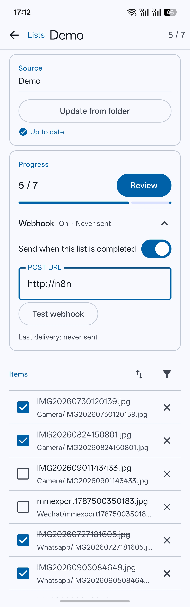

# Listea

> **Turn tasks into a feed.**
>
> A swipe-first review interface for repetitive human decisions.

Listea takes work that would otherwise be a long list of small judgement calls and presents it one
item at a time, full screen, in a queue you move through with your thumb. Decide, swipe, next.

The first workload it does well is **media triage**: working through a folder of images and video
and saying what should happen to each file.

<p align="center">
  
</p>

> **Status: under active development.** It builds, it runs, and everything described below works.
> Behaviour, the database schema and the interface all still change between versions. See
> [Project status](#project-status).

---

## What is Listea?

Reviewing a few hundred files is not hard, it is just *long*. The cost is not the decision — it is
the file manager: opening something, closing it, finding your place again, remembering which ones
you already looked at.

Listea removes that. It turns a body of review work into a sequential feed:

- one item fills the screen,
- you make a lightweight decision about it,
- you swipe, and the next one is already there.

Your place, what you have finished, and what you decided are all remembered, so a queue can be put
down and picked up. When a queue is done, Listea can hand the decisions to whatever acts on them
next, over a webhook.

The idea generalises past files — see the [Roadmap](#roadmap) — but **today Listea reviews images
and videos on your device, and that is all it reviews.**

## How it works

```
Folder  →  Quick Review  or  List  →  Review items  →  Check / assign actions  →  (optional) webhook
```

1. Point Listea at a folder on your device, through Android's own folder picker.
2. Turn a folder into a queue — immediately, or as something that persists.
3. Work through it one item at a time.
4. Mark each item done, and optionally tag it with an action that says what should happen to it.
5. Send the result somewhere, if you have somewhere to send it.

Nothing is moved or renamed. [Three explicit actions](docs/file-management.md) write to storage,
and you confirm every one of them.

## Two ways to build a queue

### Quick Review

Browse into any folder and start. No setup, nothing created, nothing to clean up afterwards — it
reviews that folder's own files and stops. Available on every folder, whether or not a List covers
it.

### Lists

For work that outlives one sitting. A List covers a folder and everything beneath it, keeps its own
progress, and can be reopened, re-synced with the folder, and wired to a webhook.

<table>
<tr>
<td align="center"></td>
<td align="center"></td>
</tr>
<tr>
<td align="center"><sub>Quick Review, from any folder</sub></td>
<td align="center"><sub>A List's detail page</sub></td>
</tr>
</table>

Either way the decisions are the same decisions: checking a file in Quick Review and checking it
from a List are one act, because state belongs to the file rather than to the queue you reached it
from. See [Core concepts](docs/core-concepts.md).

## Custom actions

Review is not a yes/no machine. Checking something off says *"I have dealt with this"* — it does
not say what dealing with it meant.

So the Review bar carries your own action chips alongside the completion checkbox. You define what
each one is called and what it sends. Listea does not decide what they mean: it captures the
decision quickly, and [webhooks](docs/webhooks.md) carry it to whatever acts on it.

<p align="center">
  
</p>

Two chips are configured out of the box; add, rename, retag or remove them freely. A favourite (★)
is built in.

## Example workflow

You have a folder that syncs from somewhere — a few hundred images and videos you have not looked
at yet.

1. Open the folder in Listea and tap **Quick Review** to start there and then, or **Create List**
   if this is going to take more than one sitting.
2. Swipe through it. Each file fills the screen; swipe left to mark it done and advance, right to
   go back. Pinch to look closer; video plays in place.
3. As you go, tap ★ or one of your own chips on anything that needs more than "done" — the ones
   worth keeping, the ones to deal with later, whatever your chips mean to you.
4. When the queue runs out, Listea offers to POST the round to a webhook. The body says which
   files you processed and which chips you gave each one.
5. Something on the other end does the actual work — a script, an automation tool, anything that
   accepts an HTTP POST. Listea never touches your files to make it happen.

If you have nowhere to send it, skip steps 4 and 5. Listea is a perfectly good "get through this
folder" tool on its own.

## Current capabilities

Everything in this table works today.

| | |
|---|---|
| **Folder browsing** | Any folder you grant, through Android's Storage Access Framework. Shows whether a List covers it, and which files are already checked. |
| **Review** | Full-screen images, animated GIFs and video. Swipe to check and advance, swipe back to reconsider, pinch to 5×, per-item Info sheet. |
| **Video** | Its own transport strip: play/pause, scrubber, 0.5×–2× speed, mute. Autoplay and start-muted are settings. |
| **Quick Review** | Any folder, instantly, without creating anything. |
| **Lists** | Persistent queues over a folder and its subfolders, with progress, source-change detection and manual re-sync. Manual, file-less Lists too. |
| **Checked state** | Belongs to the file, not to the queue. Shared by every List and Quick Review that reaches the same file. |
| **Custom actions** | User-defined chips with their own display names and wire values, plus a built-in favourite. |
| **Filter and sort** | By media type, checked status and freshness; sort by name, time, size, type or unchecked-first. Applies to browsing *and* to the review queue. Shared globally or kept per folder. |
| **Review rounds** | Optionally queue only unchecked items, so each pass through a folder is its own round. |
| **Resume** | Full Review remembers where it got to. |
| **Webhooks** | Per-List and app-default endpoints, four events, a fixed JSON payload, stable public item ids, a test button, and a confirmation before anything leaves the device. |
| **Webhook history** | Every payload Listea builds is kept with its outcome, and can be inspected, resent or deleted. |
| **File management** | Opt-in deletion of checked files, always behind a full named listing and an explicit confirmation. Save a viewed file to a gallery album, or share it out. |

Details for each of these live in the [documentation](#documentation).

## Roadmap

The direction is to grow Listea from a media review app into a **general task review engine** —
same feed, same gestures, many kinds of work. Three pieces of architecture stand between here and
there:

1. **Review templates** — abstract the Review screen so different task types can present
   themselves differently. Today's image/video experience becomes one template among several.
2. **Cross-platform-ready structure** — organise domain logic, models and boundaries so an iOS
   implementation is possible later. No framework has been chosen, and iOS is not being built yet.
3. **A general task model** — let a reviewable item be something other than a local file.

**Next milestone: a check-in task workflow**, as the first non-media task type. Not because
check-ins are the point, but because building one forces task data, state, actions and presentation
to stop being welded to image and video files.

**None of this is implemented.** It describes where the project is going, not what it does. The
full version is in [docs/roadmap.md](docs/roadmap.md).

## Documentation

**→ [Full documentation](docs/README.md)**

| | |
|---|---|
| [Getting started](docs/getting-started.md) | Build it, grant a folder, run your first review |
| [Core concepts](docs/core-concepts.md) | Roots, Lists, items, rounds, and where state lives |
| [Review and actions](docs/review-and-actions.md) | Every gesture, control and behaviour in Review |
| [Webhooks](docs/webhooks.md) | Events, payload format, history, resending |
| [File management](docs/file-management.md) | Everything that touches your files |
| [Settings](docs/settings.md) | Every switch, and what it changes |
| [Development](docs/development.md) | Environment, build, tests, project layout |
| [Roadmap](docs/roadmap.md) | Where this is going, and why |

## Project status

Listea is under active development and is not stable.

- The database schema changes between versions. Migrations are written and shipped, so upgrading in
  place is expected to keep your data — but the schema is not settled, and no version of it is
  promised to survive.
- Settings, defaults and interface details move around.
- The webhook payload has changed shape before and may again; see [Webhooks](docs/webhooks.md) for
  what is currently on the wire.

Listea reads the folder you grant it and changes nothing there on its own. Even so, it is not yet a
tool to point at data you cannot afford to have a bug touch.

Builds are published on the [releases page](https://github.com/Dgama/Listea/releases). The current
one is a debug build, signed with the standard Android debug key.

## Licence

None yet. No licence has been chosen for this project, so no rights to use, copy or modify the code
are granted by default. This will be settled before the project asks for outside contributions.
