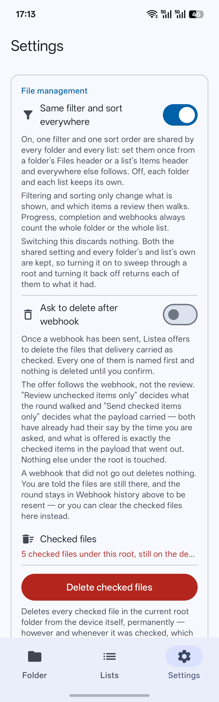

# File management

Everything Listea does that touches storage.

> **Read this page before switching anything on it describes.** One of these operations deletes
> files from the device permanently, and there is no undo.

- [What Listea does not do](#what-listea-does-not-do)
- [Delete checked files](#delete-checked-files)
- [Write access](#write-access)
- [Ask to delete after webhook](#ask-to-delete-after-webhook)
- [Save to Listea](#save-to-listea)
- [Share](#share)
- [Permissions](#permissions)
- [Root boundaries](#root-boundaries)

## What Listea does not do

Listea **never moves, renames or overwrites** anything in the folder you granted. Browsing a
folder, creating a List, reviewing files, checking them, tagging them and sending a webhook are all
read-only as far as your storage is concerned.

Exactly three things write to storage, and every one of them is something you asked for explicitly:

| | What it writes | Touches the original? |
|---|---|---|
| [Delete checked files](#delete-checked-files) | Deletes files under the root, permanently | Yes — deletes it |
| [Save to Listea](#save-to-listea) | Copies a file into `DCIM/Listea` | No |
| [Share](#share) | Copies a file into Listea's own cache | No |

<p align="center">
  
</p>

## Delete checked files

**Settings → File management → Delete checked files.** The one thing Listea does that destroys
something outside its own database.

It deletes **every checked file under the current root folder** from the device itself, permanently.

**Nothing happens without an explicit confirmation, and the confirmation is the full listing rather
than a count.** Every file is named, grouped under the folder that holds it, and the list scrolls:

```
xxx/yyyy
->file.jpg
xxx/zzz
->file2.txt, file3.mp4
```

**What is offered.** Only files Listea still believes exist: checked, not already flagged missing,
and under the current root. It reads the same per-file state everything else does, so a file checked
in a folder no List covers is offered exactly like one checked from a List's page — see
[Where state lives](core-concepts.md#where-state-lives).

This is **wider than a review round and wider than a List**. It covers every checked file under the
root, however and whenever it was checked. The Settings line above the button counts exactly that,
and reading it as a List's progress or a round's tally is the easiest mistake it invites.

**How files are found.** Each file is resolved from its path at delete time, one folder listing per
folder rather than a stale URI per file — a document URI captured months ago is exactly the kind of
thing that goes stale. If things have been moved around outside the app, update the relevant List
from its folder first.

**Afterwards**, the decision is kept and the file is flagged missing — both on the file itself and
on any List row pointing at it — so a List whose files you deleted stays complete and says its
sources are missing, exactly as it would after a re-sync. **Update from folder → remove missing
items** is there for anyone who wants the rows gone too.

**Partial runs are reported as partial runs.** Each file is its own provider call, so this cannot be
a transaction: a provider that refuses one file has still deleted the ones before it. Files that are
genuinely gone are what the database is updated from, never the set that was attempted — a file that
would not delete keeps its decision and its List rows exactly as they were.

## Write access

Deleting needs **write access to the root**. Android hands that over through the folder picker and
nowhere else — there is no separate "allow file changes" prompt to ask for — so a root granted
before this feature existed can only be read.

Listea asks for it in place rather than sending you to look for it. The delete pauses on **Allow
Listea to delete files?**; *Grant access* opens the picker already inside the folder in use, and
confirming it resumes the delete where it left off.

**Choosing a different folder there is refused rather than acted on**, so this can never turn into a
root change and can never delete a List.

## Ask to delete after webhook

**Settings → File management → Ask to delete after webhook.** Off by default.

With it on, a webhook that has **actually been delivered** is followed by an offer: the files that
delivery carried as checked are still on the device — should they stay there?

**The offer follows the webhook, not the review**, and that is the whole of its semantics. Every
other switch has already had its say by the time it appears: *Review unchecked items only* decided
what the round walked, *Send checked items only* decided what the payload carried. What is offered
is exactly the checked items in the payload that went out, and nothing else.

That makes it **narrower** than *Delete checked files* above, which covers every checked file under
the root however and whenever it was checked. The dialog says which of the two it is rather than
leaving them to be confused, and lists every file by name, grouped by folder, exactly as the other
one does.

**A delivery that did not go out deletes nothing and offers nothing.** Instead it says so, and says
where the round went: it is kept in [Webhook history](webhooks.md#webhook-history), to be resent
from there, or the files can be cleared from File management by hand. Deleting the files a round
described before anybody has received it would destroy the only copy of what the round was about.

Declining is free either way — the files stay, the items keep their decisions, and nothing about
the round changes.

**It fires for any delivery Listea decided to make on your behalf**: a review being left, a Quick
Review queue running out, a List going complete. **Not** for the *Test webhook* button, and **not**
for a resend from the history — neither is a round you just finished, and offering to delete files
off the back of a button labelled *Test* would be indefensible.

It is also silent when the payload came from a manual List, which has no files to delete, and when
nothing in it was both checked and still on the device.

Deleting from the offer is the same permanent operation as above, with the same
[write-access](#write-access) requirement. If the root can only be read, the offer says so and
points at File management, which is the only place that can ask Android for the grant.

## Save to Listea

In any viewer's [Info sheet](review-and-actions.md#the-info-sheet): copies the file you are looking
at into a `DCIM/Listea` album, which your phone's gallery app shows as an album called **Listea**.

- Offered on **all four viewing surfaces** — full Review, Quick Review, the plain file viewer and
  the list-item viewer.
- **It is not a tag and not an action.** It takes effect immediately, is not stored on the item, and
  no webhook hears about it.
- **Saving the same file twice says so** instead of making a second copy.
- **Images and video only.** An album has nothing to do with anything else.
- The original is not touched.

`DCIM` rather than `Pictures` because it is the one primary directory that accepts both images and
video, and a folder under `DCIM` is what gallery apps turn into a visible album.

## Share

Beside Save, on the same four surfaces: hands the file to whatever else is on the phone, through
Android's own chooser.

Just as detached from the item as Save is — nothing is tagged, checked or delivered by sharing.

Listea copies the file into its own cache first and shares **that** through a `FileProvider`,
because a SAF document URI handed straight to another app is read by some receivers and quietly
refused by others. What is in the chooser is whatever the phone has installed and differs from
device to device: Listea names no app and promises no destination.

Staged copies are swept up on the next share, a day after they were made. Nothing can reach one by
asking — the provider is not exported, and access rides on the one-off read grant attached to the
share intent.

## Permissions

Listea declares two, and neither is asked for at launch.

| Permission | What for |
|---|---|
| `INTERNET` | Webhook delivery, and nothing else. Not a runtime permission. |
| `WRITE_EXTERNAL_STORAGE`, capped at API 28 | Asked for the first time you **Save to Listea** on Android 9 or below. On Android 10 and up an app writes its own media through MediaStore with no permission at all, so newer devices are never asked. |

**Folder access is not a runtime permission.** You grant it by picking a folder in the system
picker, and it persists across restarts. Write access to that folder comes from the same picker —
see [Write access](#write-access).

## Root boundaries

Everything on this page is bounded by the root you granted. Listea cannot see, read or delete
anything outside it.

Two consequences:

- **Changing the root deletes the Lists linked to the old one.** You are shown which ones first.
  Manual Lists are always kept, and nothing is rebound to the new root.
- **A file's identity is its path under the root.** Replacing a file with a different one of the
  same name, outside the app, hands the new file the old one's checked state — and therefore its
  place in a deletion.

---

Next: [Settings](settings.md) for where these switches live, or [Webhooks](webhooks.md) for what
the delete offer follows.
