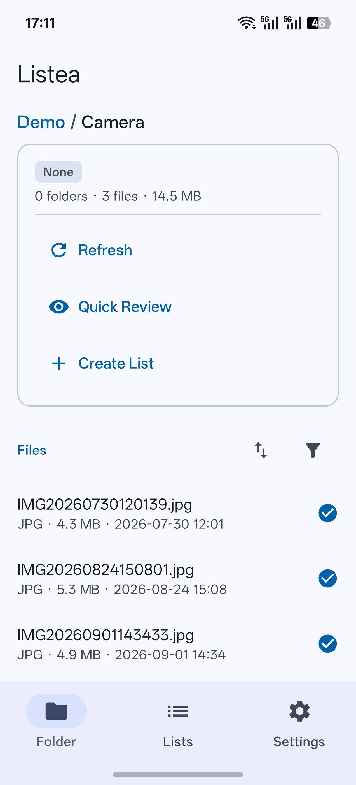

# Getting started

Getting Listea onto a device, pointed at a folder, and through its first review.

- [Install a build](#install-a-build)
- [Build it yourself](#build-it-yourself)
- [First launch: grant a folder](#first-launch-grant-a-folder)
- [Browse to something worth reviewing](#browse-to-something-worth-reviewing)
- [Start a Quick Review](#start-a-quick-review)
- [Create a List](#create-a-list)
- [Reviewing](#reviewing)
- [Optional: wire up a webhook](#optional-wire-up-a-webhook)
- [Keeping a List in sync](#keeping-a-list-in-sync)

## Install a build

Prebuilt APKs are on the [releases page](https://github.com/Dgama/Listea/releases). Download the
APK and install it; Android will warn about installing from an unknown source, which is expected
for an app distributed outside the Play Store.

Current builds are **debug** builds, signed with the standard Android debug key. That means they
are debuggable, larger than a release build, and cannot be installed over a future release-signed
build without uninstalling first.

Requirements: **Android 7.0 (API 24) or newer**.

## Build it yourself

You need Android Studio, or a standalone Android SDK, with **API level 37** installed. The build
uses Java 11 language level and the Gradle wrapper in the repository — no separate Gradle install.

```bash
git clone https://github.com/Dgama/Listea.git
cd Listea

# Point the build at your SDK. This file is gitignored and is never committed.
echo "sdk.dir=/path/to/Android/Sdk" > local.properties

./gradlew assembleDebug        # build the APK
./gradlew installDebug         # build and install on a connected device
./gradlew testDebugUnitTest    # run the unit tests
```

Opening the project in Android Studio and pressing Run works too; Studio writes `local.properties`
for you.

More detail — dependencies, project layout, what the tests cover — is in
[Development](development.md).

## First launch: grant a folder

On first launch the **Folder** tab has nothing to show, because Listea has not been given anywhere
to look.

1. Go to **Settings → Storage**.
2. Tap **Select folder**.
3. Pick a folder in the system picker.

That folder becomes the **root**: the top of everything Listea can see. The grant survives
restarts, and Listea never reaches outside it.

Grant the folder you actually want to work in rather than the whole of internal storage. Several
things in the app are scoped to "under this root" — counts, checked-file totals, and the delete
action in [File management](file-management.md) — and a narrower root makes all of them easier to
reason about.

> Changing the root later **deletes the Lists linked to the old root**. You are shown which ones
> first. Manual Lists are never touched.

## Browse to something worth reviewing

The **Folder** tab now lists the root's contents. Tap a subfolder to go into it; the breadcrumb at
the top walks back up. Tapping a file opens a plain viewer — a gallery that changes nothing.

<p align="center">
  
</p>

Each folder card says what relationship the folder has to a List — **None**, **List** or
**Sublist** — and offers up to four actions. See [Core concepts](core-concepts.md#folder-types)
for what the three types mean.

## Start a Quick Review

The fastest way in. In any folder, tap **Quick Review**.

It reviews the files sitting **directly in that folder** — not its subfolders — and it creates
nothing. No List is made, consulted or replaced. Your decisions are still saved, because they are
saved against the files themselves.

Quick Review always starts at the first unchecked item and does not remember where it got to.

## Create a List

For work that will take more than one sitting, or that covers a whole subtree.

In the folder you want, tap **Create List**. Listea scans that folder and everything beneath it and
builds a List from the files it finds. If another List already covers the same ground, you are
asked to confirm the replacement first — Lists are not allowed to overlap.

The List appears on the **Lists** tab, with its progress, and can be opened, reviewed, re-synced
and wired to a webhook from its detail page.

You can also create a List with no folder behind it at all and type items into it by hand.

## Reviewing

Open a List and tap **Review**, or use **Quick Review** from a folder. Either way:

| Gesture | What it does |
|---|---|
| **Swipe left** | Mark the current item checked, and advance |
| **Swipe right** | Go back one item, changing nothing |
| **Pinch** | Zoom, up to 5×; drag to pan inside the picture |
| **Tap the media** | Show or hide the top and bottom bars |

The bottom bar carries the completion checkbox, **★ Favourite**, your own custom action chips, and
**Info**. Tapping a chip tags the item; it does not check it. Checking and tagging are separate
decisions and neither implies the other.

The full behaviour of every control is in [Review and actions](review-and-actions.md).

## Optional: wire up a webhook

If you have something that should act on your decisions — a script, an automation tool, anything
that accepts an HTTP POST — Listea can send it the results of a round.

1. Open the List's detail page and expand **Webhook**.
2. Switch it on and paste a URL.
3. Tap **Test webhook** to check the receiver before relying on it.

The real delivery fires when the List transitions from incomplete to complete, and asks you first.
There are three other events you can switch on, an app-wide default endpoint used by Quick Review,
and a history of every payload Listea has ever built. All of it is in [Webhooks](webhooks.md).

## Keeping a List in sync

Files on disk change; a List does not follow them automatically.

A List's **Source** card says whether its folder has changed since the List was built. **Update
from folder** shows exactly what was added and what went missing, and applies it only when you
confirm.

Checked state survives the update. Files that vanished stay in the List, flagged as missing,
keeping what you decided about them, until you choose to clear them.

---

Next: [Core concepts](core-concepts.md) for the model underneath all of this, or
[Review and actions](review-and-actions.md) for everything the Review screen does.
