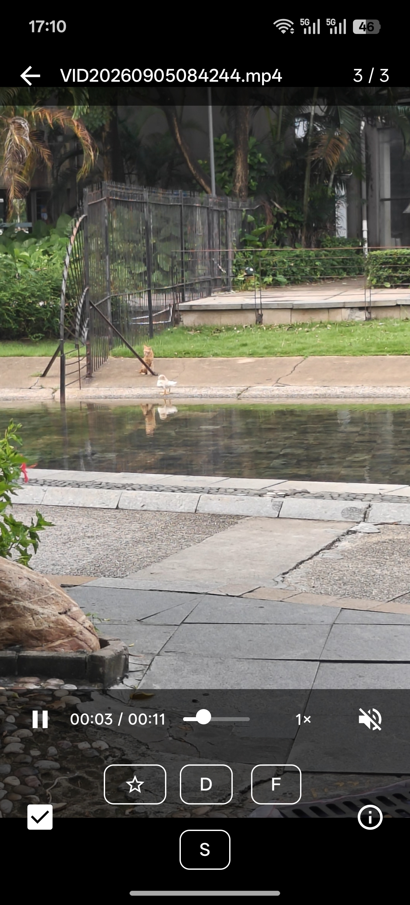
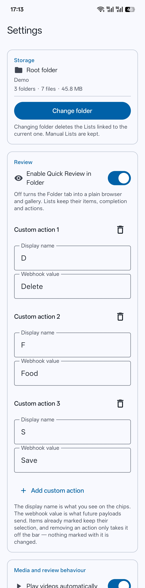
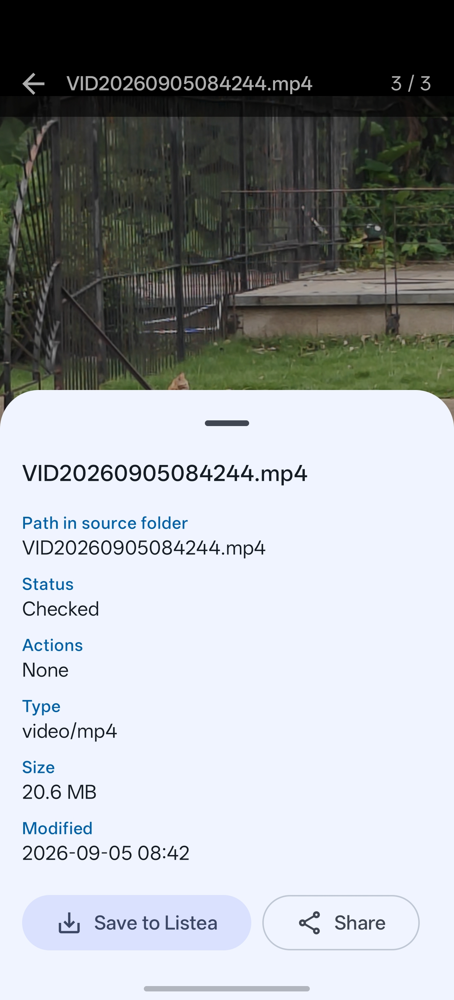

# Review and actions

The Review screen: every gesture, control and behaviour, and the actions that go on an item.

- [The screen](#the-screen)
- [Gestures](#gestures)
- [The action bar](#the-action-bar)
- [Custom actions](#custom-actions)
- [The Info sheet](#the-info-sheet)
- [Zoom](#zoom)
- [Video](#video)
- [The four viewing surfaces](#the-four-viewing-surfaces)
- [Filtering and sorting](#filtering-and-sorting)
- [Rounds](#rounds)
- [Resuming](#resuming)
- [Finishing a queue](#finishing-a-queue)

## The screen

One file fills the screen. A thin bar along the top gives you back, the filename, and your position
in the queue. A bar along the bottom carries the decisions. Tapping the media hides both, and
tapping again brings them back.

  

Images (JPEG/PNG/WebP), animated GIFs and video all render in place. There is no fullscreen
button — the picture is already the whole screen.

Full Review and Quick Review are the **same screen**. They differ in where the queue came from and
in a handful of strings, not in what any control does.

## Gestures

| Gesture | What it does |
|---|---|
| **Swipe left** | Mark the current item checked, then advance |
| **Swipe right** | Go back one item. Changes nothing |
| **Pinch** | Zoom, up to 5× |
| **Drag while zoomed** | Pan inside the picture |
| **Tap the media** | Show or hide the top and bottom bars |
| **Back** | Leave the review |

Swiping right is a navigation, not an undo: it never unchecks anything. To uncheck an item, swipe
back to it and use the checkbox.

## The action bar

Along the bottom, in order:

- **Completion checkbox** — check or uncheck the current item without moving.
- **★ Favourite** — the built-in action.
- **Your custom actions** — however many you have configured, in the order you configured them.
- **Info** — opens the [Info sheet](#the-info-sheet).

Checking and tagging are independent. Tapping ★ does not check an item; checking an item does not
tag it. Nothing on this bar implies anything else on it.

## Custom actions

Custom actions are the answer to "review is not a yes/no decision". Checking something off says you
dealt with it. An action says **what dealing with it meant** — and what should happen to it next.

  

Each one has two fields, configured in **Settings → Review**:

| Field | What it is |
|---|---|
| **Display name** | What you see on the chip. Keep it short — the bar is narrow. |
| **Webhook value** | The string the payload sends for this action. |

Listea attaches no meaning to either. Whether a chip means *archive*, *upload*, *delete later* or
*ask me again tomorrow* is decided entirely by whatever receives the
[webhook](webhooks.md#the-payload).

There can be none, or many. Two are configured out of the box.

Three properties worth knowing, all of which follow from an item storing the action's **id** and
nothing else:

- **Renaming is free.** Changing a display name or a webhook value changes future payloads and
  touches no stored item. Wire values are resolved at delivery time, not at the moment you tapped
  the chip.
- **Removing an action takes it off the bar only.** Items already marked with it keep the mark —
  invisible and unsent, but not rewritten. Listea does not quietly revise decisions you made.
- **Order is one decision.** The bar, the Info sheet and the payload all use the same order:
  favourite first, then your actions as configured.

## The Info sheet

Everything the media screen deliberately stopped saying. It scrolls, which is what keeps it usable
in landscape.

  

| Row | Notes |
|---|---|
| **Title** | The full filename, wrapped rather than cut. |
| **Path in source folder** | Where the file sits, relative to the queue's folder. |
| **List** | The owning List. Absent in a Quick Review, which came from no List — saying otherwise would be a claim about where the decision went. |
| **Status** | *Checked* or *Not checked*. |
| **Actions** | The actions on this item, or *None*. |
| **Source** | Only shown when there is something to say: *Manual item — no file*, or *Missing from the source folder*. |
| **Type, Size, Modified** | Read from the storage provider when the sheet opens, so the sheet appears immediately and these rows fill in. |

At the bottom, two controls that act on the **file** rather than on the item:

- **Save to Listea** — copies what you are looking at into a `DCIM/Listea` album.
- **Share** — hands the file to another app through Android's own chooser.

Neither is a tag, an action or a check. Neither is stored on the item, and no webhook hears about
either. Full details, including the permission and caching behaviour, are in
[File management](file-management.md#save-to-listea).

## Zoom

A pinch, on every viewing surface and on everything they show — stills, GIFs and video alike.

It goes to **5×** and no further, which is where a photograph stops being detail and starts being
the decoder's guesswork. The picture zooms about the point between your fingers, so whatever you
were looking at stays under them.

**Zooming and paging are not two modes**, and there is nothing to switch between them. Every drag
is offered to the picture as panning first, and only what the picture has no room for is left to
move the card. At fitted size a swipe pages exactly as it always did; zoomed in, the card does not
begin to move until you have panned to the picture's edge, and carrying on from there turns the
page. A pinch never turns a page, however far it wanders. Vertically there is nowhere to page to,
so a zoomed picture simply stops at its top and bottom.

The zoom belongs to the file you are looking at and is dropped when you leave it: every item
arrives at its own fitted size, however closely you were looking at the last one. Rotating the
phone keeps the magnification and pulls the picture back into view rather than leaving half of it
stranded off screen.

On video the transform reaches the picture and stops there — the transport controls sit in the same
box and would otherwise be dragged off screen with it, and a press the player has already taken
never becomes a pan.

## Video

Video plays through Media3 (ExoPlayer), in place, with Listea's own transport rather than Media3's
`PlayerControlView`.

**The transport** is one strip along the bottom edge, directly above the action bar: play/pause,
the position and length, a scrubber, playback speed, and mute. Nothing else. It comes up and goes
away with the rest of the chrome on a tap.

Tapping the strip anywhere that is not a control does nothing, rather than counting as the tap on
the media that puts the chrome away — aiming at pause and missing by a few pixels should not be
read as asking for the controls to leave.

**Speed** is a menu behind its own label: 0.5×, 0.75×, 1×, 1.25×, 1.5×, 2×. A menu rather than a
button that cycles, so 2× is not four taps away from 0.75×. It belongs to the player, so it stays
put across a swipe and resets when you leave the screen.

**Mute belongs to the file, not the player.** Unmute one video and the next one still arrives muted,
because *Start videos muted* is a rule about arriving at a video rather than a mode you have to keep
switching off — so it stays true for every file except the one you decided about. Turn the setting
off and every video simply arrives audible. How loud that is remains the phone's volume keys'
business; Listea has no second volume of its own to get out of step with them.

**Autoplay** and **start muted** are both settings — see [Settings](settings.md#media-and-review-behaviour).

Why Listea has its own transport

Media3's control view dims **every pixel of the surface it is given** and lays its buttons down the
middle of it, so reaching the pause button meant blacking out the thing you were watching — a video
you could control or a video you could see, but not both. It also silently drops its transport row,
scrubber and settings button whenever it is laid out shorter than 192dp, which is roughly what a
landscape phone has left once two bars have taken their share, so half the controls came and went
with the orientation.

A strip of Listea's own is as tall as it draws, dims only itself, and is the same strip in both
orientations.

## The four viewing surfaces

The same renderer and the same gestures, with different amounts of authority:

| Surface | Reached from | Can change state |
|---|---|---|
| **Review** | A List's Review button | Yes — full action bar |
| **Quick Review** | A folder's Quick Review action | Yes — full action bar |
| **File Viewer** | Tapping a file in the Folder tab | No |
| **List item viewer** | Tapping an item on a List's page | No |

The two viewers are plain galleries: they page between siblings, show the Info sheet, and change
nothing. That they look identical to each other is the point — neither is a place where decisions
get made, so neither grows a control that suggests otherwise. Save and Share are offered on all
four.

## Filtering and sorting

Set from a folder's **Files** header or a List's **Items** header, with a filter icon and a sort
icon. The header says when either is on.

**Filter** — three groups, ANDed together. Each defaults to *All*.

| Group | Options |
|---|---|
| **Media type** | Pictures, Videos, Text |
| **Checked status** | Checked, Unchecked |
| **Freshness** | Today, 1d – 3d, 3d – 7d, 7d – 2w, 2w – 1m |

**Sort** — Default order, Name (A–Z), Name (Z–A), Newest first, Oldest first, Largest first,
Smallest first, File type, Unchecked first.

*Default order* is not a sort: it leaves the listing as it arrived — a folder's own name order, or
a List's stored order — which is what stops a hand-built List from being re-alphabetised out from
under you. Every other order falls back to name as its tie-breaker, so nothing swaps places between
one listing and the next for no reason.

Two rules hold throughout:

- **An unknown fact never excludes anything.** A file with no timestamp survives every freshness
  filter, and a file whose checked state is not tracked survives every checked filter. Sorting
  takes the opposite line: unknowns sink to the bottom in both directions.
- **Freshness is measured in whole local calendar days**, so "Today" means today whether it is nine
  in the morning or eleven at night. Nothing covers files older than a month — anything further
  back is reached by asking for *All*.

**The arrangement carries into the review.** Pressing Review queues exactly the subset the page was
showing, in the order it was showing it. That is the main thing filtering is for: pick out the
videos, review only those.

By default one filter and one sort are **shared by every folder and every List**. Switch *Same
filter and sort everywhere* off in Settings and each keeps its own. Switching it discards nothing —
both the shared arrangement and the per-listing ones are kept either way, so turning it on to sweep
through a root and turning it back off returns everything to what it had. Up to 200 per-folder
arrangements are remembered; past that the least recently set is dropped.

Filtering and sorting change **what is shown and what a review walks**, and nothing else. Progress,
completion and webhooks always count the whole folder or the whole List — see
[Rounds and queues](core-concepts.md#rounds-and-queues).

## Rounds

With **Review unchecked items only** on, opening either review queues only the items that were
unchecked at that moment, and keeps that queue for the round: an item you check stays in front of
you and stays swipeable backwards. Leaving and re-entering starts the next round.

Pair it with **Send checked items only** and each round's webhook carries exactly the decisions you
just made, however many rounds it takes to get through a folder.

When a queue comes out empty, the screen says which of the three reasons emptied it — the List has
no items, nothing matches the filter, or everything left is already checked — because only one of
those is fixed by changing the filter and you cannot tell them apart from an empty screen.

## Resuming

**Full Review** remembers where it got to, when *Remember review position* is on (it is by
default). Position is tracked by item id and stored on the List, so a re-sync, a cleanup or a
deletion cannot leave it pointing at the wrong item.

The setting decides what is **read** on entry, never what is written: the position keeps being
recorded either way, so switching resuming back on picks up where Review actually got to rather
than from wherever it was when you switched it off.

**Quick Review never resumes.** It is folder-scoped and temporary, and always starts at the first
unchecked item.

## Finishing a queue

Running out of items shows a completion screen naming what you finished and the progress of the
whole List or folder — never the round's own arithmetic. A filtered round that finishes has not
finished the List, and the page it returns to will still say so.

From there you can review again — which starts a new round — or leave.

If webhooks are configured, this is where a delivery happens. The round is reported the moment the
queue is done rather than when you leave the completion screen, so a report that has already left
the device cannot be lost to the app being killed while that screen sits there. What is sent, and
what you are asked first, is in [Webhooks](webhooks.md).

---

Next: [Webhooks](webhooks.md) for what happens to the decisions, or [Settings](settings.md) for the
switches mentioned above.
