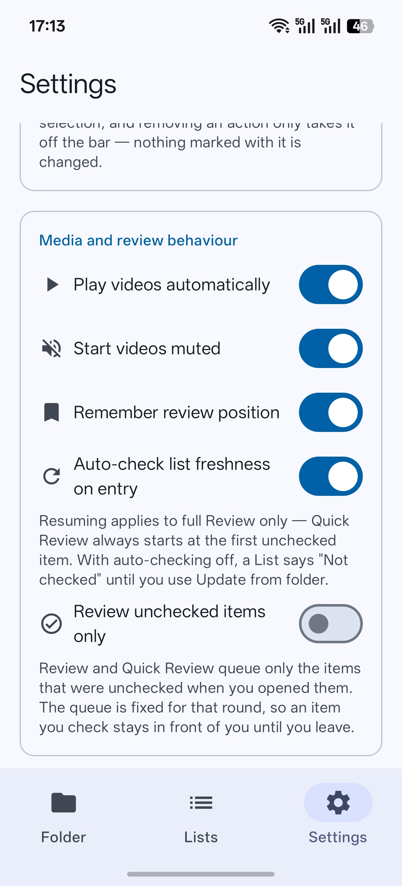

# Settings

Every switch and field on the Settings screen, what it changes, and where the full explanation
lives.

Settings are app-wide. A List's own webhook configuration is on that List's detail page, not here —
see [Webhooks](webhooks.md#the-two-configurations).

> **Every switch added after a feature shipped defaults to off**, so a fresh install and an
> untouched Settings page behave the same as they did before that feature existed.

- [Storage](#storage)
- [Review](#review)
- [Media and review behaviour](#media-and-review-behaviour)
- [Webhook](#webhook)
- [File management](#file-management)

## Storage

| Control | Default | What it does |
|---|---|---|
| **Root folder** | Not set | Shows the granted folder and what a walk of it finds: how many folders, how many files, and how much they take up. Counted the same way a List's scan counts, so the two can never disagree about what the root holds. |
| **Select folder** / **Change folder** | — | Opens the system folder picker. |

**Changing the folder deletes the Lists linked to the current one.** You are shown which ones
first. Manual Lists are kept, and nothing is rebound to the new root.

See [Core concepts → The root](core-concepts.md#the-root).

## Review

| Control | Default | What it does |
|---|---|---|
| **Enable Quick Review in Folder** | On | Off turns the Folder tab into a plain browser and gallery. Presentation only — Lists keep their items, completion and actions. |
| **Custom action** *n* | Two configured | Each has a **display name** (the chip) and a **webhook value** (what payloads send). Add, rename, retag or remove freely. |
| **Add custom action** | — | Appends one, named from the first free slot. |

Removing an action takes it off the bar only: items already marked with it keep the mark, invisible
and unsent. Renaming changes future payloads and touches no stored item.

Full behaviour: [Review and actions → Custom actions](review-and-actions.md#custom-actions). What
the values do on the wire: [Webhooks → The payload](webhooks.md#the-payload).

## Media and review behaviour

  

| Control | Default | What it does |
|---|---|---|
| **Play videos automatically** | On | Whether a video starts playing when you arrive at it. |
| **Start videos muted** | Off | Whether a video arrives muted. A rule about *arriving*, not a mode — unmuting one video does not unmute the next. The transport's mute button overrides it for that file alone. |
| **Remember review position** | On | Whether full Review resumes where it left off. Quick Review always starts at the first unchecked item regardless. |
| **Auto-check list freshness on entry** | On | Whether opening a folder-backed List scans its source folder for changes. Off, a List reports *Not checked* until you use **Update from folder**, which still works either way. |
| **Review unchecked items only** | Off | Whether entering a review queues only the items that were unchecked at that moment. The queue is fixed for the round, so an item you check stays in front of you until you leave. |

*Remember review position* decides what is **read** on entry, never what is written — the position
keeps being recorded either way.

See [Review and actions](review-and-actions.md#video) for the video behaviour, and
[Rounds](review-and-actions.md#rounds) for what *unchecked items only* does to a queue.

## Webhook

| Control | Default | What it does |
|---|---|---|
| **Default enabled** | Off | Switches the app-default webhook on. |
| **Default URL** | Empty | The default endpoint. Copied into newly created Lists; existing Lists are never changed. Used directly by Quick Review and by **Resend**. |
| **Send from Quick Review** | Off | Whether finishing a Quick Review posts `quickreview.completed` through the default webhook. Needs *Default enabled* on and a URL filled in; anything missing is reported rather than passing silently. |
| **Send when leaving a review** | Off | Whether leaving a review posts `review.exited` for the round it covered. Review uses the List's own webhook; Quick Review uses the default one and also needs the switch above. |
| **Send checked items only** | Off | Narrows every payload — the test one included — to the items that are checked. |
| **Webhook history** | — | Every payload Listea has built, with its outcome. The line counts how many records there are and how many a receiver has still not accepted. |

A queue you finished on screen does not send twice on the way out, and a round with nothing in it is
reported instead of sent.

Full behaviour, the event table and the payload format: [Webhooks](webhooks.md).

## File management

| Control | Default | What it does |
|---|---|---|
| **Same filter and sort everywhere** | On | One filter and one sort order shared by every folder and every List. Off, each keeps its own. Switching discards nothing — both are kept either way. |
| **Ask to delete after webhook** | Off | After a webhook that **actually went out**, offers to delete the files that delivery carried as checked. |
| **Checked files** | — | Counts every checked file under the current root that is still on the device. Not a List's progress and not a round's tally. |
| **Delete checked files** | — | Deletes all of them, permanently, after showing you the full named listing. |

Filtering and sorting only change what is shown, and which items a review then walks. Progress,
completion and webhooks always count the whole folder or the whole List.

> **Two different scopes, deliberately.** *Ask to delete after webhook* offers exactly the checked
> items in the payload that just went out. *Delete checked files* covers every checked file under
> the root, however and whenever it was checked. The dialogs say which one you are looking at.

Full behaviour, including write access and what happens to deleted files' decisions:
[File management](file-management.md). The filter and sort options themselves:
[Review and actions → Filtering and sorting](review-and-actions.md#filtering-and-sorting).

---

Next: [File management](file-management.md) for the destructive settings in full, or
[Webhooks](webhooks.md) for the delivery ones.
