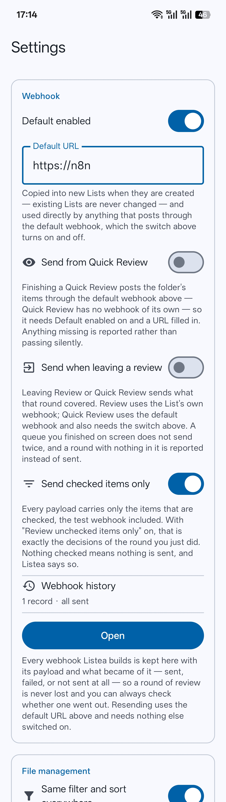

# Webhooks

How decisions made in Listea leave the device.

Webhooks are what make actions useful: the sorting happens on the phone, and the acting-on-it
happens wherever you want. Listea POSTs a JSON body describing a round of review; what happens next
is entirely the receiver's business.

Everything here is optional. Listea is fully usable with no webhook configured at all.

- [The two configurations](#the-two-configurations)
- [Events](#events)
- [The payload](#the-payload)
- [Item ids](#item-ids)
- [Narrowing what is sent](#narrowing-what-is-sent)
- [Nothing goes out without you saying so](#nothing-goes-out-without-you-saying-so)
- [A round is reported once](#a-round-is-reported-once)
- [Nothing is posted empty](#nothing-is-posted-empty)
- [Results and notices](#results-and-notices)
- [Webhook history](#webhook-history)
- [Failures](#failures)

## The two configurations

<p align="center">
  
</p>

**A List's own webhook.** On the List's detail page, expand **Webhook**: an on/off switch, a POST
URL, and a **Test webhook** button. This is what a List's own events use.

**The app default.** In **Settings → Webhook**: *Default enabled* and *Default URL*. It does two
separate jobs:

1. It is **copied into newly created Lists**, as their starting configuration. Existing Lists are
   never changed by editing it.
2. It is **used directly** by anything that has no List behind it — Quick Review — and by
   **Resend** from the history.

Quick Review has no webhook configuration of its own and is not getting one. It is folder-scoped
and temporary, so it posts to the default URL as it stands right now.

## Events

| Event | Fires when | Posts to | Items | Needs |
|---|---|---|---|---|
| `list.completed` | A List goes from incomplete to complete | The List's URL | The whole List | The List's webhook on |
| `list.webhook.test` | The **Test webhook** button | The List's URL | The whole List | A usable URL |
| `quickreview.completed` | A Quick Review queue is finished | The **default** URL | That folder's round | *Send from Quick Review* |
| `review.exited` | A review round ends, finished or not | See below | That review's round | *Send when leaving a review* |

**`list.completed`** has never depended on any of the review switches and still does not. It fires
on the transition only — a List that merely stays complete never delivers again.

**`quickreview.completed`** needs *Send from Quick Review*. That switch is the whole gate: *Default
enabled* is only a template for new Lists and has no say here, so Quick Review needs the switch on
and a usable default URL. Anything missing is reported in the same dialog any other delivery
problem is, rather than passing silently.

Quick Review still fires a List's own `list.completed` if a decision made in it happens to complete
that List — without knowing the List is there, because completion is recomputed from the file state
both of them read.

**`review.exited`** needs *Send when leaving a review*. Full Review uses the List's own webhook, so
a List with its webhook switched off says so; Quick Review uses the default webhook and **also**
needs *Send from Quick Review*. A queue that finished on screen has already sent and does not send
again on the way out, and leaving a review that had nothing to queue sends nothing at all.

> **If you watch for `list.completed`, watch for `review.exited` too** once that switch is on. See
> [A round is reported once](#a-round-is-reported-once).

## The payload

One shape, for every event.

```json
{
  "event": "list.completed",
  "list": { "id": 1, "title": "2026-07-11", "completedAt": 1767100000000 },
  "items": [
    {
      "id": "0AT9K3QWMB-4H7ZP2-XC5N0V",
      "title": "a.jpg",
      "isCompleted": true,
      "relativePath": "2026-07-11/bilibili",
      "actions": ["favorite", "cust1"]
    }
  ]
}
```

Posted as `Content-Type: application/json; charset=utf-8`. Timestamps are epoch milliseconds. Any
2xx counts as success; every other status code and every network failure is a failure. The timeout
is 10 seconds on both connect and read.

| Field | Meaning |
|---|---|
| `event` | One of the four above. |
| `list.id` | The List's id, or **`0`** for a folder round, which has no List. |
| `list.title` | The List's title, or the **folder's name** for a folder round. |
| `list.completedAt` | When the List completed, or `null`. |
| `items[].id` | The item's [public id](#item-ids). Stable, never the database row number. |
| `items[].title` | The file name. |
| `items[].isCompleted` | Whether the item was processed in Listea. |
| `items[].relativePath` | The item's **folder**, relative to the root, without the file name. |
| `items[].actions` | The wire values of the actions the item carries, in bar order. |

**`isCompleted` and `actions` mean different things and neither implies the other.** `isCompleted`
says the item was processed in Listea. `actions` says what downstream automation should do with it.
Checking something off is not an action.

**`relativePath`** is the folder only — `title` already carries the file name, so join the two for
the whole path. It is empty (`""`) for an item sitting directly in the root, and `null` for a manual
item with no source file, because a fake path would be worse than none.

**`actions`** carries the **webhook value** of each action as configured *right now*, resolved at
delivery time. Renaming an action changes future payloads without touching a single stored item.
Duplicates are collapsed: two chips configured with the same wire value emit it once. The built-in
favourite always sends `favorite` and is not configurable; everything else is whatever you set in
**Settings → Review**.

A round finished in a folder's Quick Review sends this same shape with the folder standing in for
the List, which keeps one payload format on the wire rather than inventing a second one. The
per-item `relativePath` comes out identical to what a List over the same folder would have produced.

## Item ids

`id` is a 24-character public id, assigned when the item is created and never changed. **It is safe
to use as a primary key on the receiving side.** The format, what each field means, and why the same
file gets a new id on each arrival are documented in
[Core concepts → Item identity](core-concepts.md#item-identity).

> **Changed in v10.** This field used to be the SQLite row number (`"id": 12`). That number
> restarted at 1 on a reinstall and was drawn from two different sequences depending on which review
> mode sent it, so it was never safe to key on. It is no longer on the wire at all. Existing items
> were given public ids at upgrade, timestamped from when they were actually created.

## Narrowing what is sent

**Send checked items only** narrows **every** payload — the test one included — to the items that
are checked. What the test button sends stays an honest preview of a real delivery.

Nothing is filtered out of a *review* by this; only out of what is sent.

Paired with **Review unchecked items only**, each round's payload carries exactly the decisions you
just made:

| Setting | Result |
|---|---|
| Both off | A payload describes everything in scope, and the receiver decides using `isCompleted`. |
| Both on | Each round queues what was unchecked, and reports exactly what you checked in it. |

## Nothing goes out without you saying so

**Every automatic delivery asks first.** A webhook fired off the back of a swipe was the one thing
in Listea that left the device without anyone asking, which is a lot to hang on a gesture whose
whole job is to be fast. So `list.completed`, `review.exited` and `quickreview.completed` put up a
dialog — what event, which List, how many items, which webhook — and post only on **Send**.

- **Not now** sends nothing and **changes nothing else.** No item is checked or unchecked by
  answering either way; completion state is written when you swipe, not when you answer this.
- A declined payload is **kept in the webhook history**, exactly as a failed one is, so refusing
  costs nothing — send it later from Settings whenever the receiver is ready.
- Tapping outside the dialog counts as *Not now*. The safe reading of an unanswered question is
  that nothing should leave the device.
- The question comes **after** the checks, so it only appears when something really would be
  posted. A switched-off webhook or an unusable URL reports as it always did, without asking.

The two deliveries you press a button for — **Test webhook** and **Resend** — do not ask. Pressing
the button is the confirmation.

**Every send shows its progress.** A round can be hundreds of items and a receiver can be slow, so
between pressing send and hearing back there is a *Sending…* dialog naming what is on the wire. It
covers all four paths — an automatic delivery, the test button, leaving a review, a resend from the
history — and clears itself the moment the result lands, whatever the result is.

## A round is reported once

`list.completed` and `review.exited` go to the same webhook for a List review, so a round that
completes its List would otherwise describe the same swipes twice, seconds apart. **The round's own
report is the one that survives, and the completion stands down.**

The round's is the narrower and more honest of the two: with *Review unchecked items only* and
*Send checked items only* both on, `review.exited` carries exactly the decisions you just made,
while `list.completed` would carry the whole List — including items checked weeks ago and already
sent.

This only applies while *Send when leaving a review* is on. With it off there is no second payload
to prefer, so `list.completed` fires exactly as it always has.

## Nothing is posted empty

**No payload is ever posted with an empty `items` array.** A usable webhook with nothing to carry —
a review left without a single swipe, a round where nothing was checked, a List that emptied itself
— reports *Nothing to send* instead. `"items": []` would tell a receiver a round happened when none
did.

This holds for every event, the test webhook included, so testing an endpoint against a List with
nothing checked reports rather than posts.

Nothing is kept in the history for an empty payload either. There would be nothing to resend, and
nothing was attempted.

## Results and notices

Every delivery that reaches a verdict is announced, including one abandoned over an unusable URL.
The notice says what event it was, which List, how many items, and how it went.

One swipe can finish a review **and** complete the List it belongs to, which is two deliveries
against two different configurations. Each is announced in turn rather than overwriting the other,
except that two webhooks found switched off in the same moment are reported once.

A List's **Last delivery** line records what that List's own webhook did — `list.completed`,
`list.webhook.test`, and `review.exited` from a full Review. A **folder round** has no List to
record against, so a Quick Review delivery does not appear on any List's *Last delivery* line. It is
still announced, and still kept in the history.

## Webhook history

**Settings → Webhook → Webhook history.**

**Every webhook Listea builds is kept, with its payload and what became of it** — sent, failed,
refused by a switched-off webhook, or declined when it asked. It used to keep only failures, which
turned out to be the wrong shape: *did that round actually go out?* is the question people have, and
a page that answers it only when the answer is no is a page you cannot trust.

Each record is named by the moment it last reached a verdict, and says what event it was, which
List, how many items, and how it went. Tapping one shows the exact JSON that was posted, or would
have been.

Two actions per record:

- **Resend** posts the stored body, byte for byte, to the **default URL**. It asks only that a URL
  is filled in — not that *Default enabled* is on, since that switch is one of the things that might
  have gone wrong in the first place. The record is updated in place with the new verdict rather
  than a second one being appended: the history is a list of payloads and what became of each, not a
  log of every attempt at one. Offered on successful records too, because sending a round again is a
  thing people legitimately want.
- **Delete** drops it, immediately and for good. It is the only thing in the app that can lose a
  payload.

The Settings line counts both: how much history there is, and how much of it a receiver has still
not accepted. Only the second is worth a warning.

**Records carry no link back to their List, on purpose:** deleting a List must not quietly take the
history of what it sent with it.

## Failures

A failure is any non-2xx status, or any network error. Both are reported in the same dialog a
success is, and both are kept in the history to be resent.

Network errors are described in terms of the delivery rather than the JDK — *Timed out reaching
example.com:443*, *Host not found: example.com:443*, *Could not connect to…*, *TLS failed for…*.
The host and port come from the URL Listea actually opened, not from the resolved IP address, so
nothing in the message looks like your URL was rewritten.

Response bodies are never stored or shown. Failures log a short snippet to logcat only; filter with
`adb logcat -s ListeaWebhook`.

If a delivery fails and **Ask to delete after webhook** is on, nothing is deleted and you are told
where the round went. See [File management](file-management.md#ask-to-delete-after-webhook).

---

Next: [File management](file-management.md) for what a delivered webhook can lead to, or
[Settings](settings.md) for the switches above.
